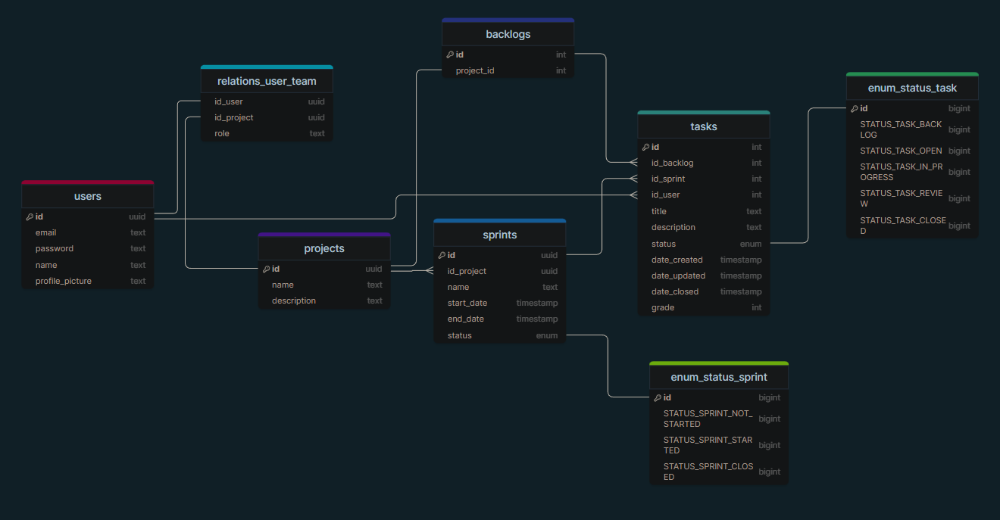
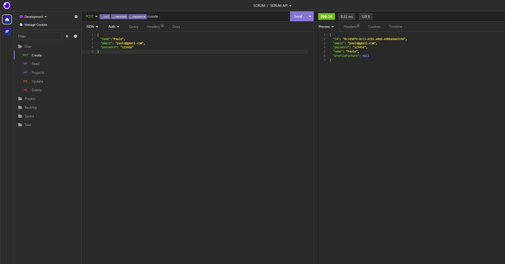

# SCRUM-API
O SCRUM-API é uma API para gerenciamento de projetos baseada no framework Spring Boot e utilizando um banco de dados PostgreSQL. Essa API foi desenvolvida para auxiliar na gestão de projetos seguindo a metodologia SCRUM, permitindo o controle de usuários, projetos, sprints, backlog e tarefas de forma eficiente.

## Principais tecnologias
 - **Spring Boot 3**: Trabalharemos com a mais nova versão do Spring Boot, que maximiza a produtividade do desenvolvedor por meio de sua poderosa premissa de autoconfiguração
 - **Spring Data JPA**: Exploraremos como essa ferramenta pode simplificar nossa camada de acesso aos dados, facilitando a integração com bancos de dados PostgreSQL
 - **OpenAPI (Swagger)**: Vamos criar uma documentação de API eficaz e fácil de entender usando a OpenAPI (Swagger), perfeitamente alinhada com a alta produtividade que o Spring Boot oferece;

## Funcionalidades

A SCRUM-API oferece as seguintes funcionalidades:

 - **Usuários**
   - Cada usuário pode pertencer a vários projetos.
   - Cada projeto pode ter vários usuários participando.

 - **Projetos**: 
   - Cada projeto possui um único backlog.
   - Ao criar um projeto, o seu backlog é automaticamente criado.
   - Ao apagar um projeto, o backlog correspondente também é apagado.

 - **Sprints**: 
   - Cada projeto pode ter várias sprints.
   - Cada sprint pode estar em um dos seguintes estados: "Não Iniciada," "Iniciada" ou "Concluída."

 - **Backlog**: 
   - O backlog é uma lista de tarefas do projeto.
   - Cada projeto possui um único backlog.

 - **Tarefas**: 
   - Cada tarefa pode estar em um dos seguintes estados: "No Backlog", "Aberta", "Em Andamento", "Revisão" ou "Concluída."

## Diagrama de Classes do Banco de Dados

O [diagrama](https://drawsql.app/teams/workspace-14/diagrams/scrum-pg) de classes do banco de dados acima representa a estrutura de dados da SCRUM-API. Ele ilustra a relação entre as entidades, incluindo Usuários, Projetos, Sprints, Backlog e Tarefas.

## Rotas da API

Você pode testar todas as funcionalidades da SCRUM-API usando o Insomnia. Basta importar o arquivo de rotas **scrum-api-insomnia.json** para o seu cliente Insomnia, nele contém todas as rotas disponíveis.

## Contribuição

Contribuições para o projeto SCRUM-API são bem-vindas. Se você deseja contribuir, siga estas etapas:

1. Faça um fork do repositório SCRUM-API.
2. Crie uma branch para a sua contribuição: `git checkout -b minha-contribuicao`
3. Faça as alterações desejadas e faça commit: `git commit -m 'Minha contribuição'`
4. Faça push das alterações para o seu fork: `git push origin minha-contribuicao`
5. Crie um pull request para a branch principal do repositório SCRUM-API.

## Licença

Este projeto é distribuído sob a licença [MIT](https://choosealicense.com/licenses/mit/). Sinta-se à vontade para usá-lo em seus projetos e fazer as modificações necessárias.

## Contato
Para dúvidas ou sugestões, entre em contato com o desenvolvedor do projeto em [mendoncajoaopedro441@gmail.com](mailto:mendoncajoaopedro441@gmail.com).